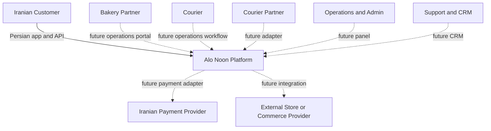
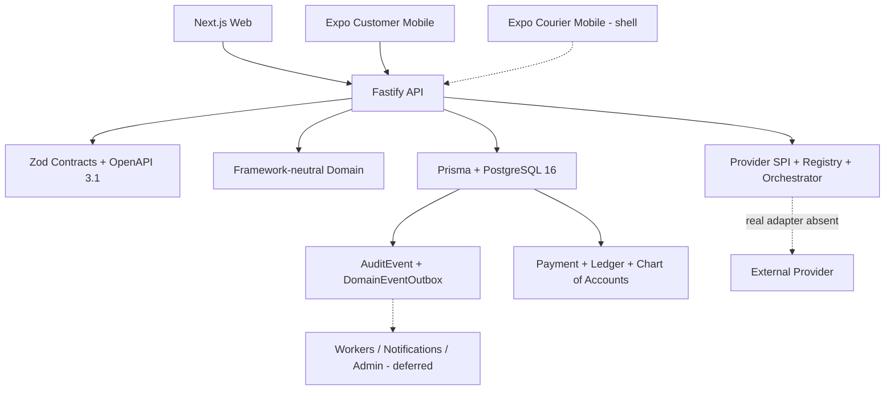
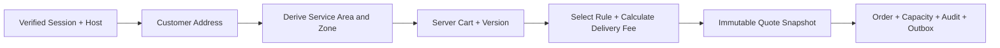
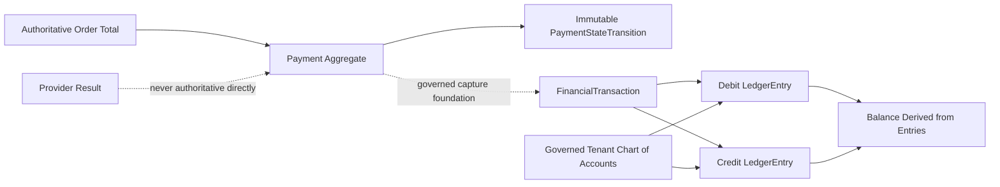
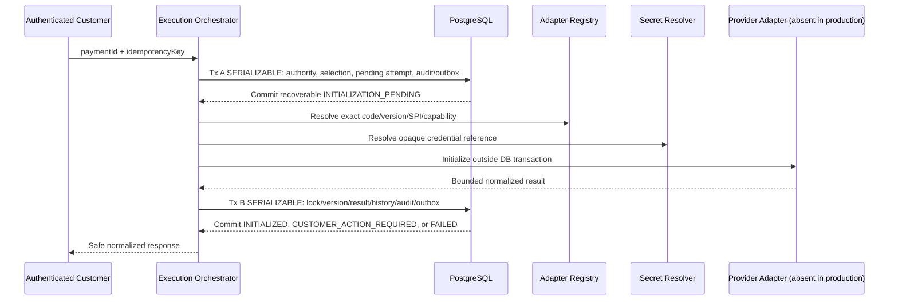
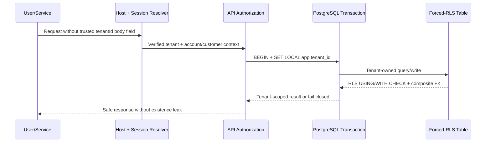

<p align="center"><a href="./README.md">فارسی</a> · <strong>English</strong></p>

<!--
Production README logo slot remains unpopulated.
Founder-approved JPEG raster sources are preserved under assets/brand/source/,
but none is an approved transparent, slogan-free horizontal hero export.
-->

<div align="center">
  <h1>Alo Noon · الو نون</h1>
  <p><strong>An API-first, multi-tenant commerce and operations platform for fresh, packaged, premium, and bakery-specific food products—starting with bread in Iran.</strong></p>
  <p>Alo Noon unifies bakery discovery, delivery pricing, production capacity, ordering, financial controls, and a Persian-first customer experience on an auditable, city-aware core.</p>
  <p><strong>Maturity:</strong> controlled-MVP engineering foundation; not production-ready and not capable of real payments yet.</p>
</div>

<p align="center">
  
  
  
  
  
  
</p>

> [!IMPORTANT] The product promise is **fresh bread**, never “hot bread.” Only
> validated, bakery-specific `SIGNATURE_FRESH` variants may claim freshly
> produced. Four founder-approved raster sources are preserved for provenance,
> but none is an approved transparent, slogan-free horizontal hero export; the
> heading above is not a permanent logo substitute. The
> [brand-asset policy](assets/brand/README.md) records their status and usage
> limits.

## Contents

- [Product vision](#product-vision)
- [Why Alo Noon](#why-alo-noon)
- [Verified current status](#verified-status)
- [System context and platform architecture](#platform-architecture)
- [Core transaction flows](#transaction-flows)
- [Domain and module map](#domain-map)
- [Financial architecture](#financial-architecture)
- [Security and data integrity](#security-integrity)
- [Technology and monorepo structure](#technology-structure)
- [Getting started](#getting-started)
- [Database, testing, and CI](#database-testing-ci)
- [API and contracts](#api-contracts)
- [Architecture decisions](#architecture-decisions)
- [Roadmap](#roadmap)
- [Contribution, ownership, and confidentiality](#governance)
- [Documentation index](#documentation-index)

<a id="product-vision"></a>

## Product vision

Alo Noon is built first for Iran. Its controlled pilot is designed for Babol,
Mazandaran. Babol is launch configuration—not a hardcoded rule. The architecture
can expand city by city across Iran and support future white-label operators;
international expansion is not the current launch priority.

The product model separates four paths:

- **Packaged traditional bread:** sangak, barbari, taftoon, and everyday
  products with explicit production, packaging, storage, and freshness
  definitions—never a “hot bread” claim.
- **Signature fresh products:** premium bakery-specific variants with controlled
  capacity and production/delivery windows.
- **Packaged fantasy and dietary bread:** specialist categories with reviewable
  product, allergen, packaging, and shelf-life contracts.
- **Pre-orders and special products:** part of the product vision; scheduled
  delivery and subscriptions are not implemented.

The partnership model treats Bakery as the legal/commercial organization and
BakeryBranch as the operating location. Courier partners and couriers are
separate operating entities. Future operations envision electric motorcycles and
an inclusive women-courier employment program; neither is a runtime feature, and
gender must not enter dispatch eligibility. CRM is intended as the memory of
customers, orders, support, and satisfaction, but its UI and automation remain
deferred. External store and commerce-provider integration is future scope.

<a id="why-alo-noon"></a>

## Why Alo Noon

Iranian bread and bakery commerce combines several operational problems:

- Bakery and local-product discovery is fragmented and data quality is uneven.
- Freshness is not measurable without an SKU definition, production time,
  packaging policy, and delivery window.
- Bakery production capacity and customer orders must be coordinated before
  acceptance.
- Delivery economics vary by city and zone and must be server-authoritative and
  auditable.
- Bakeries need capacity, catalog, order, and operations tooling—not merely a
  public listing.
- Operations, support, and investment teams need a clear view of risk, capacity,
  delivery economics, and city rollout quality.

Alo Noon addresses these needs with a modular monolith, versioned contracts,
PostgreSQL as the system of record, and controlled city-by-city growth.

<a id="verified-status"></a>

## Verified current status

This table reflects `main` after the Payment Execution Orchestrator merge.
“Foundation” means the invariant and persistence layer exists, while a complete
production workflow or operating UI does not.

| Area                               | Status                                       | Evidence and exact boundary                                                                              |
| ---------------------------------- | -------------------------------------------- | -------------------------------------------------------------------------------------------------------- |
| Multi-tenancy and forced RLS       | **Verified and merged**                      | Server-derived tenant context, composite tenant FKs, `ENABLE/FORCE RLS`, and negative cross-tenant tests |
| Address and serviceability         | **Verified and merged**                      | Customer address create/list and server-derived service area and zone                                    |
| Delivery pricing                   | **Verified and merged**                      | City/zone rules, precedence, ambiguity rejection, and bigint IRR calculation                             |
| Quote-to-Order                     | **Verified and merged**                      | Immutable snapshots, cart versioning, `SERIALIZABLE` transaction, and atomic Quote acceptance            |
| Bakery capacity reservation        | **Verified and merged**                      | Durable slot reservation in the Order transaction; release/cancellation is deferred                      |
| Customer application               | **Verified minimal flow**                    | Persian/RTL session, catalog, cart, address, quote, and Order confirmation                               |
| Identity and authorization         | **Foundation + limited runtime**             | OTP contract, revocable session, and RBAC exist; no approved production SMS provider                     |
| Payment aggregate                  | **Verified foundation**                      | Independent state machine and immutable history; clients cannot set status                               |
| Double-entry Ledger                | **Verified foundation**                      | Balanced journal, append-only entries, integer IRR, and derived balances                                 |
| Chart of Accounts                  | **Verified foundation**                      | Deterministic 14-account system chart, idempotent bootstrap, and governance                              |
| Provider foundation                | **Verified foundation**                      | Configuration, credential reference, attempt, registry/SPI, and replay guard; no real adapter            |
| Payment Execution Orchestrator     | **Initialization-only foundation**           | Two transactions around an external boundary; production server injects no real adapter/resolver         |
| Callback, inquiry, and capture     | **Deferred**                                 | Callback receipt foundation exists; verification processing, inquiry, and capture execution do not       |
| Settlement, reconciliation, refund | **Deferred**                                 | No production job, provider flow, or endpoint                                                            |
| Bakery operations                  | **Model/capacity present; workflow planned** | Branch/offering/capacity models exist; onboarding, queue, printing, and full portal do not               |
| Courier operations                 | **Model and early surface; planned**         | Partner/courier/task entities and app shell exist; dispatch, tracking, and proof flow do not             |
| Notifications and printing         | **Architecture planned**                     | Outbox exists; delivery workers, providers, and print agent do not                                       |
| CRM and support                    | **Data foundation**                          | Customer events, support cases, and incidents exist; CRM UI, segmentation, and automation are deferred   |
| Admin/operations panel             | **Planned**                                  | No production management UI                                                                              |
| External store integrations        | **Planned**                                  | No external store adapter or synchronization runtime                                                     |

<a id="platform-architecture"></a>

## System context and platform architecture

### System context

Dashed lines identify future or deferred interactions.



### Container and platform architecture



Package dependency direction is explicit: applications may depend on packages;
`packages/domain` depends on neither frameworks nor Prisma, and transport
contracts are not Prisma models.

<a id="transaction-flows"></a>

## Core transaction flows

### A. Address → Serviceability → Quote → Order



The client sends a minimal command. Tenant, customer, items, pricing rule,
branch, capacity, and totals remain server-authoritative.

### B. Atomic Quote-to-Order conversion

```mermaid
sequenceDiagram
  participant C as Customer
  participant A as API
  participant P as PostgreSQL
  C->>A: POST /api/v1/orders {quoteId, idempotencyKey}
  A->>P: BEGIN SERIALIZABLE + SET LOCAL app.tenant_id
  A->>P: Lock Quote, Cart, Address, Branch, Capacity
  A->>P: Validate immutable snapshots and ownership
  A->>P: Reserve one BakeryCapacitySlot
  A->>P: Create Order + Items + initial Transition
  A->>P: Write Audit + Outbox; accept Quote; convert Cart
  P-->>A: COMMIT all or rollback all
  A-->>C: Safe Order confirmation
```

### C. Payment and Ledger foundation



Real provider-driven capture is unavailable; this diagram describes the internal
financial invariants and foundation.

### D. Provider initialization orchestration



This is at-least-once-safe—not exactly once. A crash after invocation and before
Transaction B can repeat the invocation with the same attempt ID and idempotency
metadata. The production server currently configures no real adapter or secret
resolver, so real payments do not execute.

### E. Tenant and forced-RLS path



<a id="domain-map"></a>

## Domain and module map

| Domain                     | Current responsibility                                                               |
| -------------------------- | ------------------------------------------------------------------------------------ |
| Identity & Authorization   | OTP challenges, revocable sessions, membership, RBAC, and scope                      |
| Geography & Serviceability | Cities, zones, service areas, and coverage checks                                    |
| Catalog & Commerce         | Products, variants, offerings, freshness, Cart, and Quote                            |
| Address & Checkout         | Address ownership, authoritative pricing, snapshots, and Quote-to-Order              |
| Orders                     | Separate order/payment/production/delivery dimensions and transition history         |
| Bakery Capacity            | Branch, offering, and durable slot reservation                                       |
| Payments                   | Independent Payment aggregate and state machine                                      |
| Ledger & Chart of Accounts | Double-entry journal, immutable entries, and account governance                      |
| Provider Foundation        | Configuration, credential references, registry/SPI, attempts, and callback receipt   |
| Execution Orchestrator     | Initialization only, two transactions, and normalized outcomes                       |
| Audit & Outbox             | Transactional events and attributable audit trail                                    |
| Customer Mobile            | Persian session-through-Order-confirmation flow                                      |
| Bakery/Courier/Admin/CRM   | Models or blueprints exist; production workflows and UIs are mostly planned/deferred |

<a id="financial-architecture"></a>

## Financial architecture

- `Payment` is independent from Order, production, and delivery state.
- `CREATED → PENDING → AUTHORIZED → CAPTURED` transitions are domain governed;
  `FAILED` is terminal, and clients cannot set payment state.
- `PaymentStateTransition` is versioned and immutable.
- Every posted `FinancialTransaction` has at least two positive `LedgerEntry`
  records, distinct accounts, one currency, and balanced debit/credit totals.
- Money is stored as integer `bigint` **IRR** and transported as decimal
  strings; floating-point money is prohibited.
- The current customer app displays rials. Any future toman display must be an
  explicit, exact `IRR ÷ 10` presentation conversion and never financial truth.
- A deterministic 14-account system chart is bootstrapped idempotently for each
  tenant; system-account identity is immutable.
- Provider configuration, `PaymentAttempt`, and the Execution Orchestrator are
  separate from Payment truth. `VERIFIED` or `ACCEPTED` alone is not `CAPTURED`.
- A real Iranian gateway adapter, callback verification, inquiry, capture,
  settlement, reconciliation, and refunds remain deferred.

<a id="security-integrity"></a>

## Security and data integrity

- Tenant identity comes only from verified host/session/service context.
- Tenant-owned transactions use `SET LOCAL app.tenant_id`; covered tables enable
  and force RLS.
- Composite tenant foreign keys prevent cross-tenant relationships.
- Sensitive commands use scoped idempotency keys, canonical fingerprints, and
  deterministic replay/conflict handling.
- Quote-to-Order and multi-record financial mutations use `SERIALIZABLE`
  isolation with bounded retries.
- Referenced economic snapshots and Order/Payment/attempt/Ledger histories are
  immutable or append-only.
- Audit and outbox records commit or roll back atomically with protected state.
- Raw credential material is excluded from tables, logs, errors, audit, outbox,
  contracts, and responses; only opaque references and safe metadata persist.
- Generic Prisma `P2002` is not treated as serialization. Retries are limited to
  `40001`, `P2034`, `P2010` with meta `40001`, and exact known race constraints.
- Browser `localStorage`/`sessionStorage` and mobile storage are not
  authoritative Order or checkout sources; PostgreSQL is authoritative.
- PostgreSQL triggers and deferred constraints reject inconsistent direct-SQL
  histories and unbalanced journals.

See [SECURITY.md](SECURITY.md). Do not disclose vulnerabilities, PII,
credentials, or payment data in public issues.

<a id="technology-structure"></a>

## Technology and monorepo structure

### Verified technology

| Layer            | Repository evidence                                     |
| ---------------- | ------------------------------------------------------- |
| Language/runtime | TypeScript 5.8, Node.js `>=26.3.0`                      |
| API              | Fastify 5, Zod runtime contracts, OpenAPI 3.1           |
| Web              | Next.js 16, React 19                                    |
| Mobile           | Expo 57, React Native 0.86, Persian/RTL design tokens   |
| Data             | PostgreSQL 16, Prisma 5, forward-only migrations        |
| Tooling          | pnpm 11.17, Turborepo 2, Vitest 4, ESLint 9, Prettier 3 |
| CI               | GitHub Actions with a PostgreSQL 16 service             |

### Important directories

```text
apps/
  api/                 Fastify API and application orchestration
  web/                 Next.js public/customer web surface
  customer-mobile/     Persian-first Expo customer flow
  courier-mobile/      Early Expo courier surface
packages/
  contracts/           Zod v1 contracts and OpenAPI 3.1
  database/            Prisma schema, client, 16 migrations, DB tests
  domain/              Framework/Prisma-independent invariants
  config/              Validated runtime configuration
  design-tokens/       Shared Persian/RTL visual tokens
docs/
  architecture/        Boundaries, ownership, phase records
  decisions/           ADR-0001 through ADR-0010
  product/              Product/domain status and target models
  assets/               Governed brand, badge, and diagram assets
```

<a id="getting-started"></a>

## Getting started

### Prerequisites

- Node.js `>=26.3.0` from [`.node-version`](.node-version)
- pnpm `>=11.17.0`
- PostgreSQL 16 or Docker for integration tests and migrations

Example environment files contain placeholders only. Never commit secrets.

```bash
cp .env.example .env
cp packages/database/.env.example packages/database/.env
docker compose up -d postgres
CI=true pnpm install --frozen-lockfile
pnpm db:generate
pnpm --filter @alo-noon/database exec prisma migrate deploy
pnpm dev
```

Focused development commands:

```bash
pnpm dev:api
pnpm dev:web
pnpm dev:customer-mobile
pnpm dev:courier-mobile
```

The API defaults to `http://localhost:3001`. `GET /health` is
external-dependency independent; `GET /ready` depends on PostgreSQL. OTP request
deliberately returns `503` without an approved SMS provider. Payment execution
is not registered by the production server until a real adapter and resolver are
injected.

### Local gates

```bash
pnpm format
pnpm format:check
pnpm lint
pnpm typecheck
pnpm --filter @alo-noon/database exec prisma validate
DATABASE_URL='' pnpm test
pnpm build
pnpm audit --prod --json
pnpm audit --json
```

For integration tests, point `DATABASE_URL` to a migrated PostgreSQL 16
instance. `DATABASE_URL=''` runs only database-independent suites.

<a id="database-testing-ci"></a>

## Database, testing, and CI

### Migrations

At this documentation revision, 16 ordered migrations exist under
[`packages/database/prisma/migrations`](packages/database/prisma/migrations).
Repository discipline requires:

- additive, forward-only migrations;
- preflight checks before sensitive structural changes;
- no economic backfill without explicit review;
- no destructive downgrade—roll back the application and use a forward
  corrective migration;
- `prisma migrate deploy` against PostgreSQL 16 in CI.

`prisma db push` is not a substitute for reviewed production migrations.

### Testing strategy

- Domain-invariant and state-machine unit tests;
- Zod/OpenAPI parity and safe error-envelope tests;
- Static migration-safety tests;
- PostgreSQL integration, concurrency, and rollback tests;
- Forced-RLS and cross-tenant/cross-customer denial tests;
- Direct-SQL integrity and append-only-history guards;
- Builds for all application surfaces and dependency audits.

Test count is not a permanent documentation KPI. CI measures every change; the
latest payment-architecture merge passed 279 tests on PostgreSQL 16.14.

### CI/CD

The current [`.github/workflows/ci.yml`](.github/workflows/ci.yml) runs for pull
requests and pushes to `main`: frozen install, Prisma generation, all
migrations, format, lint, typecheck, tests, and build. Dependency audits are
required local final gates but are not currently in the workflow. Production
deployment, environment promotion, smoke testing, and rollback automation are
not implemented.

Maintenance note: `actions/checkout@v4`, `actions/setup-node@v4`, and
`pnpm/action-setup@v4` currently emit a deprecated Node runtime warning and
should be upgraded in a separate CI-maintenance PR. The warning does not change
the current test result.

<a id="api-contracts"></a>

## API and contracts

- Canonical specification:
  [`packages/contracts/openapi/alo-noon.v1.yaml`](packages/contracts/openapi/alo-noon.v1.yaml),
  OpenAPI `3.1.0`, current API document version `0.10.0`.
- Runtime schemas: [`packages/contracts/src/v1`](packages/contracts/src/v1).
- Transport invariants are independent of Prisma models and APIs return safe
  error envelopes.
- Executable endpoints cover health/readiness, discovery/catalog,
  serviceability, auth/session, address, Cart/Quote, and Order.
- `/api/v1/payments/initialize` has a contract and injectable route, but the
  production server registers no execution service without a real
  adapter/resolver.

<a id="architecture-decisions"></a>

## Architecture decisions

The complete status and purpose index is in
[`docs/decisions/README.md`](docs/decisions/README.md).

| ADR                                                               | Decision                                                        |
| ----------------------------------------------------------------- | --------------------------------------------------------------- |
| [0001](docs/decisions/ADR-0001-modular-monolith.md)               | Modular monolith for the MVP                                    |
| [0002](docs/decisions/ADR-0002-product-freshness-separation.md)   | Separate Fresh Signature and packaged-product promises          |
| [0003](docs/decisions/ADR-0003-multi-city-partner-abstraction.md) | Multi-city and partner abstraction                              |
| [0004](docs/decisions/ADR-0004-domain-modeling-strategy.md)       | Independent domain, versioned contracts, normalized persistence |
| [0005](docs/decisions/ADR-0005-order-state-model.md)              | Separate Order, Payment, Production, and Delivery state         |
| [0006](docs/decisions/ADR-0006-money-and-price-snapshots.md)      | Bigint money and immutable snapshots                            |
| [0007](docs/decisions/ADR-0007-domain-events-audit-and-outbox.md) | Separate events, audit, and engagement                          |
| [0008](docs/decisions/ADR-0008-payment-ledger-foundation.md)      | Payment and double-entry Ledger foundation                      |
| [0009](docs/decisions/ADR-0009-payment-provider-foundation.md)    | Provider SPI and secure credential references                   |
| [0010](docs/decisions/ADR-0010-payment-execution-orchestrator.md) | Two-transaction initialization orchestrator                     |

<a id="roadmap"></a>

## Roadmap

This order communicates technical dependency, not committed dates.

1. **Completed foundation:** domain/contracts/database, multi-tenancy, forced
   RLS, atomic checkout, Payment/Ledger/Chart, provider foundation, and the
   initialization-only orchestrator.
2. **Payment execution path:** approved real Iranian gateway adapter, secret
   manager, outbound transport, redirect, callback verification, inquiry, and
   transactional capture.
3. **Production authentication:** approved SMS provider, operational abuse
   controls, and OTP delivery runbook.
4. **Bakery operations:** onboarding, operational capacity, production/packaging
   queue, Order acceptance, and printing.
5. **Courier operations:** dispatch, assignment commands, proof, tracking, and
   SLA controls.
6. **Notifications and financial operations:** workers, delivery channels,
   settlement, reconciliation, and refunds with authority and audit.
7. **CRM:** timeline projection, support workflows, consent-aware automation,
   and UI.
8. **External integrations:** reviewed store/commerce, maps, courier, and
   analytics adapters.
9. **Iranian city expansion:** city-by-city rollout through pricing,
   serviceability, and partner configuration.
10. **Future enterprise/white-label readiness:** operator governance, branding,
    and deployment isolation when scale evidence justifies them—not the current
    launch priority.

<a id="governance"></a>

## Contribution, ownership, and confidentiality

This is a proprietary and confidential repository; [LICENSE.md](LICENSE.md)
grants no open-source license. [CONTRIBUTING.md](CONTRIBUTING.md),
[AGENTS.md](AGENTS.md), and the
[Persian governance record](docs/00-governance/ALO_NOON_PROJECT_GOVERNANCE_FA.md)
define working rules:

- Repository state overrides prompt assumptions or memory.
- One branch and one pull request per coherent capability.
- Conventional Commits and mandatory final review.
- CI before merge; no admin bypass, force-push, or force-merge.
- Additive migration discipline with rollback/forward-correction planning.
- Architecture Impact Assessment and ADRs for architectural decisions.
- Authoritative server-side persistence; client storage is not truth.
- Secrets, PII, credentials, and payment data stay out of commits, issues,
  screenshots, and logs.
- Skill/tool automation remains subject to repository scope, authority, and
  security policy.

Ownership and copyright are stated in [LICENSE.md](LICENSE.md). This README
publishes no private phone number, email address, credential, or sensitive
operational contact.

<a id="documentation-index"></a>

## Documentation index

- [Documentation map](docs/README.md)
- [Architecture index](docs/architecture/README.md)
- [ADR index](docs/decisions/README.md)
- [Persian product vision](docs/00-vision/PRODUCT_VISION_FA.md)
- [Product requirements](docs/product/PRODUCT_REQUIREMENTS.md)
- [Catalog and freshness model](docs/product/CATALOG_AND_FRESHNESS_MODEL.md)
- [Order lifecycle](docs/product/ORDER_LIFECYCLE.md)
- [Bakery partner model](docs/product/BAKERY_PARTNER_MODEL.md)
- [Courier and delivery model](docs/product/COURIER_AND_DELIVERY_MODEL.md)
- [CRM foundation](docs/product/CRM_FOUNDATION.md)
- [Security policy](SECURITY.md)
- [OpenAPI](packages/contracts/openapi/alo-noon.v1.yaml)
- [Brand-asset governance](assets/brand/README.md)
- [Capability-label catalog](docs/assets/badges/README.md)
- [Diagram policy](docs/assets/diagrams/README.md)

---

<p align="center">
  <strong>Alo Noon</strong> — city-aware bread commerce and operations for Iran,
  with a precise freshness promise and an auditable engineering path.
  <br />
  Documentation revision: 2026-08-03 · Approved raster sources are preserved; a production hero export still requires separate approval.
</p>
