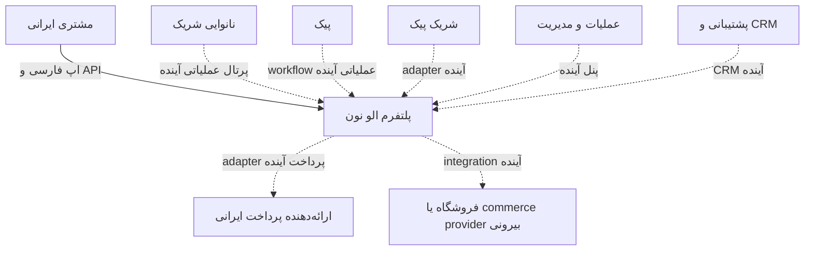
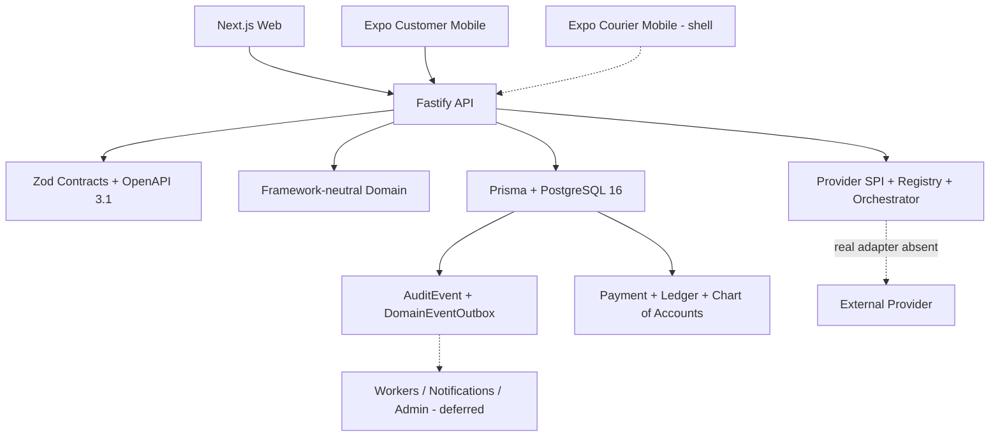
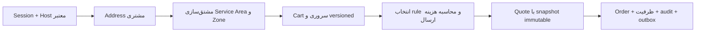
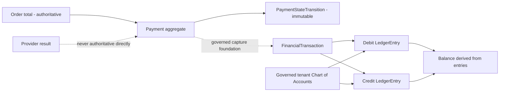
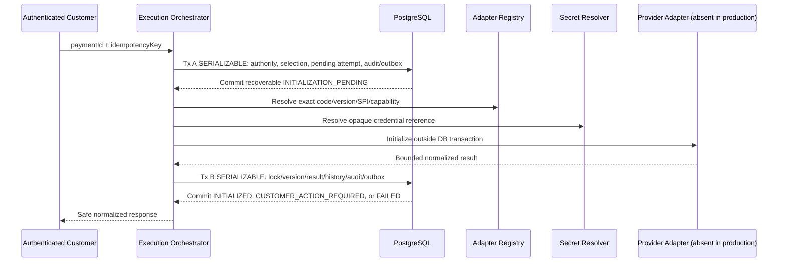
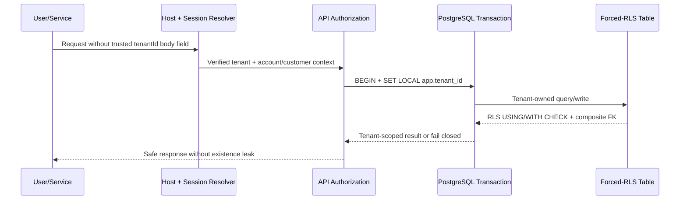

<p align="center"><strong>فارسی</strong> · <a href="./README.en.md">English</a></p>

<!--
Production README logo slot remains unpopulated.
Founder-approved JPEG raster sources are preserved under assets/brand/source/,
but none is an approved transparent, slogan-free horizontal hero export.
-->

<div align="center" dir="rtl">
  <h1>الو نون · Alo Noon</h1>
  <p><strong>پلتفرم API-first و چندمستاجریِ تجارت و عملیات برای نان تازه، بسته‌بندی‌شده و محصولات ویژه نانوایی—با شروع از بازار ایران.</strong></p>
  <p>الو نون کشف نانوایی، قیمت‌گذاری ارسال، ظرفیت تولید، سفارش، عملیات مالی و تجربهٔ فارسی مشتری را روی یک هستهٔ قابل‌ممیزی و شهرمحور یکپارچه می‌کند.</p>
  <p><strong>وضعیت بلوغ:</strong> زیرساخت مهندسی MVP کنترل‌شده؛ هنوز آمادهٔ بهره‌برداری production یا پرداخت واقعی نیست.</p>
</div>

<p align="center">
  
  
  
  
  
  
</p>

> [!IMPORTANT] وعدهٔ محصول «نان تازه» است، نه «نان داغ». فقط variantهای
> نانوایی‌محور و اعتبارسنجی‌شدهٔ `SIGNATURE_FRESH` می‌توانند ادعای تولید تازه
> داشته باشند. چهار منبع رستریِ تأییدشده توسط بنیان‌گذار برای ثبت منشأ در مخزن
> نگهداری می‌شوند، اما هیچ‌کدام خروجی شفاف، افقی و بدون شعارِ مناسب بخش آغازین
> README نیستند؛ عنوان بالا جایگزین دائمی لوگو نیست.
> [سیاست دارایی‌های برند](assets/brand/README.md) وضعیت و محدودیت استفاده را
> مشخص می‌کند.

## فهرست مطالب

- [چشم‌انداز محصول](#product-vision)
- [چرا الو نون](#why-alo-noon)
- [وضعیت فعلیِ تأییدشده](#verified-status)
- [نمای سیستم و معماری پلتفرم](#platform-architecture)
- [جریان‌های تراکنشی اصلی](#transaction-flows)
- [نقشه دامنه و ماژول‌ها](#domain-map)
- [معماری مالی](#financial-architecture)
- [امنیت و یکپارچگی داده](#security-integrity)
- [فناوری و ساختار monorepo](#technology-structure)
- [راه‌اندازی محلی](#getting-started)
- [پایگاه داده، تست و CI](#database-testing-ci)
- [API و قراردادها](#api-contracts)
- [تصمیم‌های معماری](#architecture-decisions)
- [نقشه راه](#roadmap)
- [مشارکت، مالکیت و محرمانگی](#governance)
- [نمایه مستندات](#documentation-index)

<a id="product-vision"></a>

## چشم‌انداز محصول

بازار آغازین الو نون ایران است و پایلوت کنترل‌شده برای بابل، مازندران طراحی شده
است. بابل یک configuration آغازین است، نه قاعدهٔ hardcoded. معماری می‌تواند
شهر‌به‌شهر در ایران توسعه یابد و در آینده از operatorهای white-label پشتیبانی
کند؛ توسعهٔ بین‌المللی هدف فعلی launch نیست.

مدل محصول چهار مسیر را از هم جدا می‌کند:

- **نان سنتی بسته‌بندی‌شده:** سنگک، بربری، تافتون و محصولات روزمره با تعریف روشن
  تولید، بسته‌بندی، نگهداری و تازگی؛ بدون ادعای «داغ» بودن.
- **محصولات امضادار تازه:** variantهای premium و مخصوص یک نانوایی، با ظرفیت و
  پنجرهٔ تولید/تحویل کنترل‌شده.
- **نان فانتزی و رژیمی بسته‌ای:** دسته‌های تخصصی با قرارداد محصول، آلرژن،
  بسته‌بندی و shelf-life قابل‌بررسی.
- **پیش‌سفارش و محصولات ویژه:** بخشی از چشم‌انداز محصول؛ scheduled delivery و
  subscription هنوز پیاده‌سازی نشده‌اند.

مدل مشارکت، نانوایی را سازمان حقوقی/تجاری و شعبه را محل عملیاتی می‌داند. شریک
پیک و پیک نیز موجودیت‌های مستقل عملیاتی‌اند. چشم‌انداز آینده شامل ناوگان
موتورسیکلت برقی و برنامهٔ فراگیر اشتغال بانوان است؛ این برنامه‌ها هنوز runtime
نیستند و جنسیت نباید وارد منطق dispatch شود. CRM به‌عنوان حافظهٔ مشتری، سفارش،
پشتیبانی و رضایت یک قابلیت محوریِ پلتفرم است، اما UI و automation آن deferred
است. اتصال فروشگاه‌ها و providerهای تجارت بیرونی نیز فقط ظرفیت آینده است.

<a id="why-alo-noon"></a>

## چرا الو نون

بازار نان و محصولات نانوایی در ایران با چند مسئلهٔ هم‌زمان روبه‌رو است:

- کشف نانوایی و محصول محلی پراکنده و کیفیت داده نامطمئن است.
- «تازگی» بدون تعریف SKU، زمان تولید، بسته‌بندی و پنجرهٔ تحویل قابل سنجش نیست.
- نانوایی، ظرفیت تولید و سفارش مشتری باید پیش از پذیرش قطعی هماهنگ شوند.
- هزینهٔ تحویل در شهر و منطقه‌های مختلف باید server-authoritative و قابل‌ممیزی
  باشد.
- نانوایی‌ها برای ورود دیجیتال به ابزار ظرفیت، کاتالوگ، سفارش و عملیات نیاز
  دارند، نه فقط یک listing عمومی.
- تیم‌های عملیات، پشتیبانی و سرمایه‌گذاری به یک نمای روشن از ریسک، ظرفیت، اقتصاد
  تحویل و کیفیت rollout نیاز دارند.

الو نون این مسئله را با یک modular monolith، قراردادهای نسخه‌دار، PostgreSQL به
عنوان منبع حقیقت و توسعهٔ کنترل‌شدهٔ شهر‌به‌شهر حل می‌کند.

<a id="verified-status"></a>

## وضعیت فعلیِ تأییدشده

این جدول وضعیت `main` پس از merge شدن Payment Execution Orchestrator را نشان
می‌دهد. «بنیاد» یعنی invariant و persistence وجود دارد، اما جریان production
کامل یا UI عملیاتی هنوز موجود نیست.

| حوزه                                | وضعیت                                 | شواهد و مرز دقیق                                                                               |
| ----------------------------------- | ------------------------------------- | ---------------------------------------------------------------------------------------------- |
| Multi-tenancy و forced RLS          | **تأیید و merge شده**                 | tenant context سمت سرور، composite tenant FK، `ENABLE/FORCE RLS` و تست منفی cross-tenant       |
| Address و serviceability            | **تأیید و merge شده**                 | ایجاد/فهرست نشانی مشتری، مشتق‌سازی service area و zone سمت سرور                                |
| قیمت‌گذاری ارسال                    | **تأیید و merge شده**                 | rule شهر/zone، precedence، ambiguity rejection و محاسبهٔ bigint IRR                            |
| Quote-to-Order                      | **تأیید و merge شده**                 | snapshot immutable، cart version، تراکنش `SERIALIZABLE` و پذیرش اتمیک Quote                    |
| رزرو ظرفیت نانوایی                  | **تأیید و merge شده**                 | رزرو پایدار slot هم‌تراکنش با Order؛ release/cancellation هنوز deferred                        |
| اپ مشتری                            | **جریان حداقلی تأییدشده**             | تجربهٔ فارسی/RTL برای session، کاتالوگ، cart، address، quote و confirmation سفارش              |
| هویت و مجوز                         | **بنیاد + runtime محدود**             | OTP contract، session قابل‌ابطال و RBAC موجود؛ SMS provider تأییدشدهٔ production وجود ندارد    |
| Payment aggregate                   | **بنیاد تأییدشده**                    | state machine مستقل و تاریخچهٔ immutable؛ client وضعیت پرداخت را تعیین نمی‌کند                 |
| Double-entry Ledger                 | **بنیاد تأییدشده**                    | journal متوازن، entryهای append-only و مبلغ صحیح IRR؛ balance مشتق‌شده است                     |
| Chart of Accounts                   | **بنیاد تأییدشده**                    | chart سیستمی ۱۴ حسابی، bootstrap idempotent و governance حساب                                  |
| Provider foundation                 | **بنیاد تأییدشده**                    | configuration، credential reference، attempt، registry/SPI و replay guard؛ بدون adapter واقعی  |
| Payment Execution Orchestrator      | **بنیاد initialization-only**         | دو تراکنش پیرامون boundary خارجی؛ production server adapter/resolver واقعی inject نمی‌کند      |
| Callback، inquiry و capture         | **Deferred**                          | callback receipt foundation وجود دارد؛ verification processing، inquiry و capture اجرایی نیست  |
| Settlement، reconciliation و refund | **Deferred**                          | هیچ job/provider flow یا endpoint production وجود ندارد                                        |
| عملیات نانوایی                      | **مدل/ظرفیت موجود؛ workflow planned** | مدل branch/offering/capacity موجود؛ onboarding، production queue، printing و portal کامل نیست  |
| عملیات پیک                          | **مدل و surface اولیه؛ planned**      | entityهای partner/courier/task و shell اپ وجود دارد؛ dispatch، tracking و proof flow اجرا نشده |
| اعلان و چاپ                         | **معماری planned**                    | outbox وجود دارد؛ delivery provider، worker و print agent عملیاتی نیست                         |
| CRM و پشتیبانی                      | **بنیاد داده**                        | customer event، support case و incident موجود؛ CRM UI، segmentation و automation deferred      |
| Admin/operations panel              | **Planned**                           | UI مدیریت production وجود ندارد                                                                |
| External store integrations         | **Planned**                           | adapter یا همگام‌سازی فروشگاه بیرونی وجود ندارد                                                |

<a id="platform-architecture"></a>

## نمای سیستم و معماری پلتفرم

### System context

این نمودار actorهای فعلی و آینده را جدا می‌کند. خط‌چین‌ها نمایانگر قابلیت‌های
آینده/deferred هستند.



### Container و platform architecture



وابستگی packageها یک‌طرفه است: applicationها می‌توانند به packageها وابسته
باشند؛ `packages/domain` به framework یا Prisma وابسته نیست و transport contract
از Prisma model ساخته نمی‌شود.

<a id="transaction-flows"></a>

## جریان‌های تراکنشی اصلی

### A. Address → Serviceability → Quote → Order



client فقط command حداقلی می‌فرستد؛ tenant، customer، اقلام، قیمت، rule، branch،
ظرفیت و total سمت سرور تعیین می‌شوند.

### B. تبدیل اتمیک Quote به Order

```mermaid
sequenceDiagram
  participant C as Customer
  participant A as API
  participant P as PostgreSQL
  C->>A: POST /api/v1/orders {quoteId, idempotencyKey}
  A->>P: BEGIN SERIALIZABLE + SET LOCAL app.tenant_id
  A->>P: Lock Quote, Cart, Address, Branch, Capacity
  A->>P: Validate immutable snapshots and ownership
  A->>P: Reserve one BakeryCapacitySlot
  A->>P: Create Order + Items + initial Transition
  A->>P: Write Audit + Outbox; accept Quote; convert Cart
  P-->>A: COMMIT all or rollback all
  A-->>C: Safe Order confirmation
```

### C. Payment و Ledger foundation



capture واقعیِ provider در production وجود ندارد؛ این نمودار invariant مالی و
foundation داخلی را نشان می‌دهد.

### D. Provider initialization orchestration



این مدل at-least-once-safe است، نه exactly-once. crash بعد از invocation و قبل
از Tx B ممکن است invocation را با همان attempt ID و idempotency metadata تکرار
کند. production server در حال حاضر orchestrator را با adapter و secret resolver
واقعی پیکربندی نمی‌کند؛ بنابراین پرداخت واقعی انجام نمی‌شود.

### E. مسیر tenant و forced RLS



<a id="domain-map"></a>

## نقشه دامنه و ماژول‌ها

| دامنه                      | مسئولیت فعلی                                                                   |
| -------------------------- | ------------------------------------------------------------------------------ |
| Identity & Authorization   | OTP challenge، session قابل‌ابطال، membership، RBAC و scope                    |
| Geography & Serviceability | city، operational zone، service area و ارزیابی پوشش                            |
| Catalog & Commerce         | product/variant/offering، freshness، cart و quote                              |
| Address & Checkout         | مالکیت نشانی، pricing قطعی، snapshot و Quote-to-Order                          |
| Orders                     | stateهای مستقل order/payment/production/delivery و transition history          |
| Bakery Capacity            | branch، offering و slot رزروشدهٔ پایدار                                        |
| Payments                   | Payment aggregate و state machine مستقل                                        |
| Ledger & Chart of Accounts | journal دوطرفه، entry immutable و governance حساب                              |
| Provider Foundation        | configuration، credential reference، registry/SPI، attempts و callback receipt |
| Execution Orchestrator     | initialization-only، دو تراکنش و outcome نرمال‌شده                             |
| Audit & Outbox             | رویداد تراکنشی و trail قابل‌انتساب                                             |
| Customer Mobile            | جریان فارسی session تا confirmation سفارش                                      |
| Bakery/Courier/Admin/CRM   | مدل یا blueprint موجود؛ workflow و UI production عمدتاً planned/deferred       |

<a id="financial-architecture"></a>

## معماری مالی

- `Payment` از Order و stateهای تولید/تحویل مستقل است.
- transitionهای `CREATED → PENDING → AUTHORIZED → CAPTURED` تحت policy
  دامنه‌اند؛ `FAILED` terminal است و client نمی‌تواند state را تعیین کند.
- `PaymentStateTransition` تاریخچهٔ versioned و immutable است.
- هر `FinancialTransaction` posted حداقل دو `LedgerEntry` مثبت، با حساب‌های
  مجزا، currency یکسان و debit/credit متوازن دارد.
- پول در persistence و contract به‌صورت integer `bigint` در **IRR** نگهداری و به
  شکل decimal string منتقل می‌شود؛ floating-point ممنوع است.
- اپ فعلی قیمت را به ریال نمایش می‌دهد. هر نمایش آیندهٔ «تومان» باید صرفاً
  presentation دقیق و آشکارِ `IRR ÷ 10` باشد و هرگز منبع حقیقت مالی نشود.
- chart سیستمی ۱۴ حسابی برای هر tenant به‌صورت deterministic و idempotent
  bootstrap می‌شود؛ identity حساب سیستمی immutable است.
- configuration provider، `PaymentAttempt` و Execution Orchestrator از Payment
  truth جدا هستند. outcome `VERIFIED` یا `ACCEPTED` به‌تنهایی `CAPTURED` نیست.
- adapter واقعی درگاه ایرانی، callback verification، inquiry، capture،
  settlement، reconciliation و refund هنوز deferred هستند.

<a id="security-integrity"></a>

## امنیت و یکپارچگی داده

- tenant فقط از host/session/service context معتبر می‌آید؛ body نمی‌تواند
  `tenantId` authoritative تعیین کند.
- تراکنش‌های tenant-owned از `SET LOCAL app.tenant_id` استفاده می‌کنند و RLS روی
  tableهای مربوطه enabled و forced است.
- composite tenant foreign key از رابطهٔ cross-tenant جلوگیری می‌کند.
- commandهای حساس idempotency key، fingerprint canonical و replay/conflict
  deterministic دارند.
- Quote-to-Order و mutationهای مالی چندرکوردی با isolation سطح `SERIALIZABLE` و
  retry محدود اجرا می‌شوند.
- snapshotهای اقتصادی و تاریخچه‌های order/payment/attempt/ledger پس از مرجع‌شدن
  immutable یا append-only هستند.
- audit و outbox با mutation متناظر در همان تراکنش commit یا rollback می‌شوند.
- credential خام در table، log، error، audit، outbox، contract یا response ذخیره
  نمی‌شود؛ فقط reference opaque و metadata غیرحساس وجود دارد.
- generic Prisma `P2002` serialization تلقی نمی‌شود؛ فقط `40001`، `P2034`،
  `P2010` با meta `40001` و race constraint دقیق retry می‌شوند.
- browser `localStorage`/`sessionStorage` و mobile storage منبع حقیقت order یا
  checkout نیستند؛ PostgreSQL منبع authoritative است.
- trigger و deferred constraintهای PostgreSQL مسیر direct SQL برای تاریخچه‌های
  ناسازگار و journal نامتوازن را fail closed می‌کنند.

جزئیات گزارش آسیب‌پذیری در [SECURITY.md](SECURITY.md) است. از issue عمومی برای
افشای vulnerability، PII، credential یا دادهٔ پرداخت استفاده نکنید.

<a id="technology-structure"></a>

## فناوری و ساختار monorepo

### فناوری‌های تأییدشده

| لایه           | فناوری موجود در repository                              |
| -------------- | ------------------------------------------------------- |
| زبان و runtime | TypeScript 5.8، Node.js `>=26.3.0`                      |
| API            | Fastify 5، Zod runtime contracts، OpenAPI 3.1           |
| Web            | Next.js 16، React 19                                    |
| Mobile         | Expo 57، React Native 0.86، RTL/Persian design tokens   |
| Data           | PostgreSQL 16، Prisma 5، migrationهای forward-only      |
| Tooling        | pnpm 11.17، Turborepo 2، Vitest 4، ESLint 9، Prettier 3 |
| CI             | GitHub Actions با PostgreSQL 16 service                 |

### ساختار اصلی

```text
apps/
  api/                 Fastify API and application orchestration
  web/                 Next.js public/customer web surface
  customer-mobile/     Persian-first Expo customer flow
  courier-mobile/      Early Expo courier surface
packages/
  contracts/           Zod v1 contracts and OpenAPI 3.1
  database/            Prisma schema, client, 16 migrations, DB tests
  domain/              Framework/Prisma-independent invariants
  config/              Validated runtime configuration
  design-tokens/       Shared Persian/RTL visual tokens
docs/
  architecture/        Boundaries, ownership, phase records
  decisions/           ADR-0001 through ADR-0010
  product/              Product/domain status and target models
  assets/               Governed brand, badge, and diagram assets
```

<a id="getting-started"></a>

## راه‌اندازی محلی

### پیش‌نیازها

- Node.js `>=26.3.0` مطابق [`.node-version`](.node-version)
- pnpm `>=11.17.0`
- PostgreSQL 16 یا Docker برای integration test و migration

فایل‌های example فقط placeholder هستند؛ secret واقعی را commit نکنید.

```bash
cp .env.example .env
cp packages/database/.env.example packages/database/.env
docker compose up -d postgres
CI=true pnpm install --frozen-lockfile
pnpm db:generate
pnpm --filter @alo-noon/database exec prisma migrate deploy
pnpm dev
```

فرمان‌های توسعهٔ متمرکز:

```bash
pnpm dev:api
pnpm dev:web
pnpm dev:customer-mobile
pnpm dev:courier-mobile
```

API به‌طور پیش‌فرض روی `http://localhost:3001` است. `GET /health` مستقل از
dependency خارجی و `GET /ready` وابسته به PostgreSQL است. OTP request بدون SMS
provider تأییدشده عمداً `503` می‌دهد. route اجرای payment نیز تا زمان injection
یک adapter و resolver واقعی در production server فعال نیست.

### gateهای محلی

```bash
pnpm format
pnpm format:check
pnpm lint
pnpm typecheck
pnpm --filter @alo-noon/database exec prisma validate
DATABASE_URL='' pnpm test
pnpm build
pnpm audit --prod --json
pnpm audit --json
```

برای integration test، `DATABASE_URL` را به PostgreSQL 16 مهاجرت‌یافته وصل کنید؛
`DATABASE_URL=''` فقط suiteهای بدون database را اجرا می‌کند.

<a id="database-testing-ci"></a>

## پایگاه داده، تست و CI

### Migration

در revision مستندشدهٔ حاضر، ۱۶ migration ترتیبی در
[`packages/database/prisma/migrations`](packages/database/prisma/migrations)
وجود دارد. discipline مخزن:

- migration افزایشی و forward-only؛
- preflight قبل از structural change حساس؛
- عدم backfill اقتصادی بدون review صریح؛
- عدم downgrade مخرب؛ rollback application و سپس forward corrective migration؛
- `prisma migrate deploy` در CI روی PostgreSQL 16.

`prisma db push` جایگزین migration review برای تغییر production نیست.

### راهبرد تست

- unit test invariantهای domain و state machine؛
- Zod/OpenAPI parity و safe error envelope؛
- static migration safety tests؛
- PostgreSQL integration، concurrency و rollback tests؛
- forced-RLS و cross-tenant/cross-customer denial؛
- direct-SQL integrity guards و append-only history؛
- build همهٔ surfaceها و audit dependency.

تعداد test یک KPI ثابت مستنداتی نیست. CI هر commit/PR را از نو می‌سنجد؛ آخرین
merge معماری پرداخت، ۲۷۹ test را روی PostgreSQL 16.14 گذراند.

### CI/CD

workflow فعلی [`.github/workflows/ci.yml`](.github/workflows/ci.yml) روی PR و
push به `main` اجرا می‌شود و شامل install frozen، Prisma generate، deploy همهٔ
migrationها، format، lint، typecheck، test و build است. audit dependency در
workflow فعلی نیست و باید در final local gate اجرا شود. deployment production،
promotion محیط، smoke test و rollback automation هنوز پیاده‌سازی نشده‌اند.

یادداشت نگهداشت: actionهای `actions/checkout@v4`، `actions/setup-node@v4` و
`pnpm/action-setup@v4` هشدار runtime Node قدیمی دارند و باید در PR مستقل CI
به‌روزرسانی شوند؛ این هشدار صحت testهای فعلی را تغییر نمی‌دهد.

<a id="api-contracts"></a>

## API و قراردادها

- مشخصات canonical:
  [`packages/contracts/openapi/alo-noon.v1.yaml`](packages/contracts/openapi/alo-noon.v1.yaml)
  با OpenAPI `3.1.0` و نسخهٔ فعلی `0.10.0`.
- schemaهای runtime: [`packages/contracts/src/v1`](packages/contracts/src/v1).
- invariantهای transport از Prisma model مستقل‌اند و APIها safe error envelope
  برمی‌گردانند.
- endpointهای اجرایی فعلی شامل health/readiness، discovery/catalog،
  serviceability، auth/session، address، cart/quote و order هستند.
- `/api/v1/payments/initialize` contract و injectable route دارد، اما production
  server بدون adapter/resolver واقعی آن را register نمی‌کند.

<a id="architecture-decisions"></a>

## تصمیم‌های معماری

نمایهٔ کامل و وضعیت هر تصمیم در
[docs/decisions/README.md](docs/decisions/README.md) است. تصمیم‌های کلیدی:

| ADR                                                               | تصمیم                                              |
| ----------------------------------------------------------------- | -------------------------------------------------- |
| [0001](docs/decisions/ADR-0001-modular-monolith.md)               | Modular monolith برای MVP                          |
| [0002](docs/decisions/ADR-0002-product-freshness-separation.md)   | تفکیک Fresh Signature و محصول بسته‌بندی‌شده        |
| [0003](docs/decisions/ADR-0003-multi-city-partner-abstraction.md) | abstraction شهر و partner                          |
| [0004](docs/decisions/ADR-0004-domain-modeling-strategy.md)       | domain مستقل، contract نسخه‌دار، persistence نرمال |
| [0005](docs/decisions/ADR-0005-order-state-model.md)              | stateهای مستقل order/payment/production/delivery   |
| [0006](docs/decisions/ADR-0006-money-and-price-snapshots.md)      | bigint money و snapshot immutable                  |
| [0007](docs/decisions/ADR-0007-domain-events-audit-and-outbox.md) | تفکیک event، audit و engagement                    |
| [0008](docs/decisions/ADR-0008-payment-ledger-foundation.md)      | Payment و double-entry ledger                      |
| [0009](docs/decisions/ADR-0009-payment-provider-foundation.md)    | provider SPI و credential-reference امن            |
| [0010](docs/decisions/ADR-0010-payment-execution-orchestrator.md) | initialization orchestrator دو‌تراکنشی             |

<a id="roadmap"></a>

## نقشه راه

ترتیب، dependency فنی را نشان می‌دهد و تعهد زمانی نیست.

1. **Foundation تکمیل‌شده:** domain/contract/database، multi-tenancy، forced
   RLS، checkout اتمیک، Payment/Ledger/Chart، provider foundation و orchestrator
   initialization-only.
2. **مسیر اجرای پرداخت:** adapter واقعی و تأییدشدهٔ درگاه ایرانی، secret
   manager، transport بیرونی، redirect، callback verification، inquiry و capture
   transactional.
3. **احراز هویت production:** provider تأییدشدهٔ پیامک، abuse controls عملیاتی و
   runbook تحویل OTP.
4. **عملیات نانوایی:** onboarding، ظرفیت عملیاتی، production/packaging queue،
   پذیرش سفارش و printing.
5. **عملیات پیک:** dispatch، assignment command، proof، tracking و SLA.
6. **اعلان و عملیات مالی:** workers، delivery channel، settlement،
   reconciliation و refund با authority و audit.
7. **CRM:** timeline projection، support workflow، consent-aware automation و
   UI.
8. **اتصال بیرونی:** store/commerce، maps، courier و analytics adapterهای
   review‌شده.
9. **گسترش ایران:** rollout شهر‌به‌شهر با pricing/serviceability/partner config.
10. **آمادگی enterprise/white-label آینده:** operator governance، branding و
    deployment isolation بر اساس شواهد مقیاس؛ نه هدف launch فعلی.

<a id="governance"></a>

## مشارکت، مالکیت و محرمانگی

این مخزن proprietary و محرمانه است؛ [LICENSE.md](LICENSE.md) مجوز open-source
اعطا نمی‌کند. [CONTRIBUTING.md](CONTRIBUTING.md)، [AGENTS.md](AGENTS.md) و
[governance فارسی](docs/00-governance/ALO_NOON_PROJECT_GOVERNANCE_FA.md) قواعد
کار را تعیین می‌کنند:

- repository state بر prompt/حافظه مقدم است؛
- یک branch و یک PR برای یک capability منسجم؛
- Conventional Commits و review نهایی اجباری؛
- CI قبل از merge؛ بدون admin bypass، force-push یا force-merge؛
- migration افزایشی و برنامهٔ rollback/forward correction؛
- Architecture Impact Assessment و ADR برای تغییر تصمیم‌های معماری؛
- persistence authoritative سمت سرور؛ client storage منبع حقیقت نیست؛
- secret، PII، credential و دادهٔ پرداخت وارد commit، issue، screenshot یا log
  نمی‌شود؛
- skill/tool automation تحت همان scope، authority و security policy مخزن است.

مالکیت و حق نشر طبق [LICENSE.md](LICENSE.md) متعلق به Alo Noon است. هیچ شماره
تلفن، ایمیل خصوصی یا کانال عملیاتی حساس در این README منتشر نمی‌شود.

<a id="documentation-index"></a>

## نمایه مستندات

- [نقشهٔ مستندات](docs/README.md)
- [نمایهٔ معماری](docs/architecture/README.md)
- [ADR index](docs/decisions/README.md)
- [چشم‌انداز محصول فارسی](docs/00-vision/PRODUCT_VISION_FA.md)
- [نیازمندی‌های محصول](docs/product/PRODUCT_REQUIREMENTS.md)
- [مدل تازگی و کاتالوگ](docs/product/CATALOG_AND_FRESHNESS_MODEL.md)
- [چرخهٔ سفارش](docs/product/ORDER_LIFECYCLE.md)
- [مدل شریک نانوایی](docs/product/BAKERY_PARTNER_MODEL.md)
- [مدل پیک و تحویل](docs/product/COURIER_AND_DELIVERY_MODEL.md)
- [بنیاد CRM](docs/product/CRM_FOUNDATION.md)
- [امنیت](SECURITY.md)
- [OpenAPI](packages/contracts/openapi/alo-noon.v1.yaml)
- [حاکمیت دارایی‌های برند](assets/brand/README.md)
- [catalog برچسب‌های قابلیت](docs/assets/badges/README.md)
- [سیاست نمودارها](docs/assets/diagrams/README.md)

---

<p align="center" dir="rtl">
  <strong>الو نون</strong> — زیرساخت شهرمحور تجارت و عملیات نان برای بازار ایران،
  با وعدهٔ دقیق «تازگی» و مسیر مهندسی قابل‌ممیزی.
  <br />
  بازنگری مستندات: ۲۰۲۶-۰۸-۰۳ · منابع رستریِ تأییدشده حفظ شده‌اند؛ خروجی نهایی برای بخش آغازین README هنوز نیازمند تأیید مستقل است.
</p>
