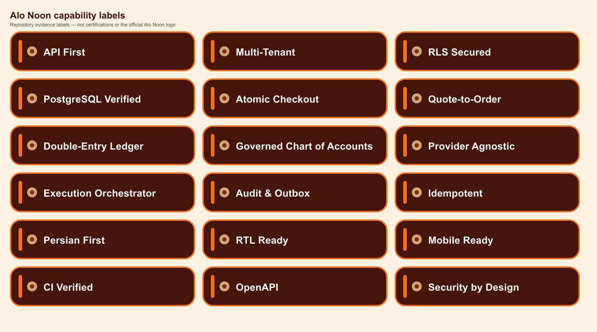

# Alo Noon capability-label catalog

These assets are repository capability labels, not certifications and not the
official Alo Noon logo. They summarize evidence described in the Persian and
English READMEs; critical meaning remains available as text.

## Visual system

- Source palette: committed design tokens in
  [`packages/design-tokens`](../../../packages/design-tokens/src/index.ts).
- Background: primary `950` (`#431407`).
- Border/accent: primary `500` (`#F97316`).
- Secondary accent: wheat (`#D4A574`).
- Text: neutral `50` (`#FAFAFA`).
- Dimensions: every individual PNG is `520 × 112` pixels and intended for
  approximately `260 × 56` CSS-pixel display (2×/retina source).
- Shape: deterministic rounded label with a neutral capability marker. It does
  not reproduce or imply logo geometry.
- Typography: generic system-safe sans-serif outlines rendered from the SVG
  source; no Alo Noon or third-party font file is embedded.

The SVG files under [`source/`](./source/) are authoritative for these labels.
PNGs were rasterized deterministically at 2× resolution with the Sharp version
already present in the workspace dependency graph. No package or lockfile change
was required.

## Inventory

| Label                      | PNG                                                                  | Evidence meaning                                                                |
| -------------------------- | -------------------------------------------------------------------- | ------------------------------------------------------------------------------- |
| API First                  | [`api-first.png`](./api-first.png)                                   | Versioned runtime contracts and OpenAPI-owned public boundaries                 |
| Multi-Tenant               | [`multi-tenant.png`](./multi-tenant.png)                             | Tenant-owned records and server-derived tenant context                          |
| RLS Secured                | [`rls-secured.png`](./rls-secured.png)                               | PostgreSQL RLS is enabled and forced on covered tenant tables                   |
| PostgreSQL Verified        | [`postgresql-verified.png`](./postgresql-verified.png)               | Migrations and database integration tests run against PostgreSQL 16 in CI       |
| Atomic Checkout            | [`atomic-checkout.png`](./atomic-checkout.png)                       | Quote acceptance, capacity, order, audit, and outbox commit atomically          |
| Quote-to-Order             | [`quote-to-order.png`](./quote-to-order.png)                         | Authenticated conversion from immutable Quote snapshots                         |
| Double-Entry Ledger        | [`double-entry-ledger.png`](./double-entry-ledger.png)               | Balanced integer-IRR journal foundation with immutable entries                  |
| Governed Chart of Accounts | [`governed-chart-of-accounts.png`](./governed-chart-of-accounts.png) | Deterministic tenant financial bootstrap and governed accounts                  |
| Provider Agnostic          | [`provider-agnostic.png`](./provider-agnostic.png)                   | Payment domain is isolated from provider-specific types                         |
| Execution Orchestrator     | [`execution-orchestrator.png`](./execution-orchestrator.png)         | Initialization-only two-transaction orchestration boundary                      |
| Audit & Outbox             | [`audit-outbox.png`](./audit-outbox.png)                             | Protected mutations persist audit and outbox records atomically                 |
| Idempotent                 | [`idempotent.png`](./idempotent.png)                                 | Scoped command replay and deterministic conflict handling                       |
| Persian First              | [`persian-first.png`](./persian-first.png)                           | Iranian-market product language and customer experience                         |
| RTL Ready                  | [`rtl-ready.png`](./rtl-ready.png)                                   | RTL-aware design tokens and customer presentation                               |
| Mobile Ready               | [`mobile-ready.png`](./mobile-ready.png)                             | Expo customer and courier application surfaces exist                            |
| CI Verified                | [`ci-verified.png`](./ci-verified.png)                               | Repository quality workflow runs on pull requests and `main`                    |
| OpenAPI                    | [`openapi.png`](./openapi.png)                                       | OpenAPI 3.1 contract is maintained with Zod parity tests                        |
| Security by Design         | [`security-by-design.png`](./security-by-design.png)                 | Fail-closed authorization, tenant integrity, redaction, and immutable histories |

## Usage rules

- Pair labels with nearby prose; do not make image-only claims.
- Do not describe them as certification, compliance, production-readiness, PCI,
  banking, or government approval.
- Revalidate the associated code/tests before retaining a label after material
  architecture changes.
- Do not recolor or combine the labels into an unofficial logo.
- Use descriptive image alt text and avoid displaying all labels at full source
  width on mobile pages.
